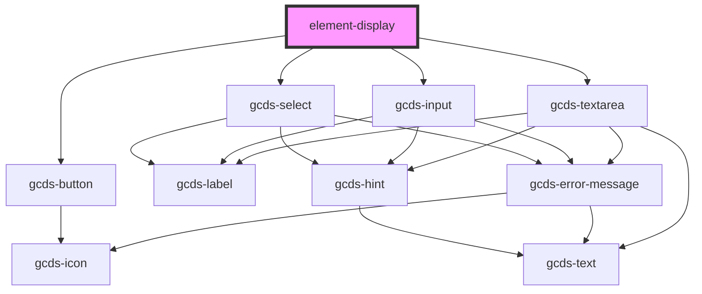

# element-display

<!-- Auto Generated Below -->

## Properties

| Property | Attribute | Description | Type                         | Default     |
| -------- | --------- | ----------- | ---------------------------- | ----------- |
| `attrs`  | `attrs`   |             | `AttributesType[] \| string` | `undefined` |
| `events` | `events`  |             | `EventType[] \| string`      | `undefined` |
| `slots`  | `slots`   |             | `SlotType[] \| string`       | `undefined` |

## Dependencies

### Depends on

- [gcds-button](../gcds-button)
- [gcds-select](../gcds-select)
- [gcds-input](../gcds-input)
- [gcds-textarea](../gcds-textarea)

### Graph

----------------------------------------------

*Built with [StencilJS](https://stenciljs.com/)*
